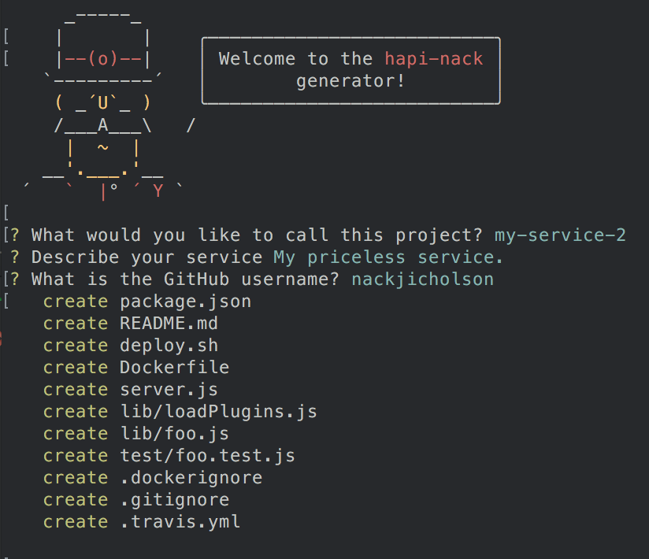

# generator-hapi-nack [![NPM version][npm-image]][npm-url] [![Build Status][travis-image]][travis-url] [![Dependency Status][daviddm-image]][daviddm-url]

> Hapi (hapijs) micro-service generator



## Installation

First, install [Yeoman](http://yeoman.io) and generator-hapi-nack.

```bash
npm install -g yo
npm install -g generator-hapi-nack
```

Then generate your new project:

```bash
cd my-project
yo hapi-nack
```

## Features

### Working hapijs Server

By default comes setup with the following plugins:

- `good` and `good-console` process reporting
- `hapi-swaggered` and `hapi-swaggered-ui` automatic documentation generator.
- `hapi-pkg` provides a "/healthcheck" route.

Also provides a sample route "/foobar" which returns a JSON response `{"foo": "bar"}`.

### NPM Scripts

**Linting with Eslint**

Configured by default to use the "airbnb/base" eslint preset which provides 
a mostly sane set of rules for writing JavaScript, learn more [here](https://github.com/airbnb/javascript)

`$ npm run lint`

Will lint your code anytime a file changes in the `lib` and `test` directory. Analyzes your code for adherence to
a code style specification. Uses the "airbnb" eslint preset.

**Tests with mocha**

`$ npm test`

Runs a test of your code using mocha. Tests can be written using es2015 as well.

`$ npm run cov`

Produces an istanbul coverage report in the `coverage/` directory.

**Dev Mode**

`$ npm run tdd`

Run a file watcher to run the tests anytime a file in `lib` or `test` is changed.

`$ npm run tdd:lint`

Run a file watcher which performs linting, code style checks, and tests anytime you save a file.

**Start the server**

`$ npm start`  
`$ npm run start:dev`

## License

MIT © [Will Vaughn](https://github.com/nackjicholson)

[npm-image]: https://badge.fury.io/js/generator-hapi-nack.svg
[npm-url]: https://npmjs.org/package/generator-hapi-nack
[travis-image]: https://travis-ci.org/nackjicholson/generator-hapi-nack.svg?branch=master
[travis-url]: https://travis-ci.org/nackjicholson/generator-hapi-nack
[daviddm-image]: https://david-dm.org/nackjicholson/generator-hapi-nack.svg?theme=shields.io
[daviddm-url]: https://david-dm.org/nackjicholson/generator-hapi-nack
